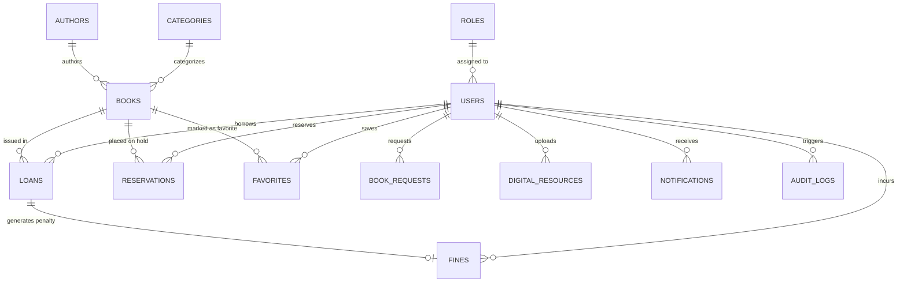

# Database Schema & Migration Architecture
## Digital Library Management System
### Thakur Shree DPS College of Engineering and Management

---

## 1. Relational Database Overview

The system database is designed in third normal form (3NF) to ensure data integrity, eliminate redundancy, and support concurrent library transactions. It operates interchangeably on **Supabase PostgreSQL** in production and **H2 In-Memory Database** during local development.

Dual compatibility is guaranteed through standard SQL-92/2003 syntax:
```sql
BIGINT GENERATED BY DEFAULT AS IDENTITY PRIMARY KEY
```

---

## 2. Entity-Relationship (ER) Diagram



---

## 3. Schema Definitions & Table Catalog

### `roles`
Stores authorization security roles.
- `id` (BIGINT, PK, IDENTITY)
- `name` (VARCHAR(50), NOT NULL, UNIQUE): `ROLE_ADMIN`, `ROLE_LIBRARIAN`, `ROLE_FACULTY`, `ROLE_STUDENT`
- `description` (VARCHAR(255))

### `users`
Stores institutional student, faculty, and administrative accounts.
- `id` (BIGINT, PK, IDENTITY)
- `student_id` (VARCHAR(50), UNIQUE): College Roll Number or Employee Code (e.g. `DPS2023CS001`)
- `email` (VARCHAR(150), NOT NULL, UNIQUE): Institutional email address
- `password` (VARCHAR(255), NOT NULL): BCrypt hash
- `full_name` (VARCHAR(150), NOT NULL)
- `phone` (VARCHAR(30))
- `department` (VARCHAR(100)): Engineering stream
- `course` (VARCHAR(50)): B.Tech, M.Tech, etc.
- `semester` (INT): Current semester (1–8)
- `role_id` (BIGINT, FK -> roles.id)
- `active` (BOOLEAN, DEFAULT TRUE): Account standing
- `created_at`, `updated_at` (TIMESTAMP)

### `categories`
Organizes books into engineering branches and basic sciences.
- `id` (BIGINT, PK, IDENTITY)
- `name` (VARCHAR(100), NOT NULL, UNIQUE): e.g. "Computer Engineering", "Artificial Intelligence"
- `code` (VARCHAR(20), UNIQUE): e.g. "CE", "AIML"
- `description` (TEXT)
- `created_at` (TIMESTAMP)

### `authors`
Curriculum textbook writers, researchers, and professors.
- `id` (BIGINT, PK, IDENTITY)
- `name` (VARCHAR(150), NOT NULL)
- `biography` (TEXT)
- `nationality` (VARCHAR(100))
- `created_at` (TIMESTAMP)

### `books`
Physical textbooks and digital repository references.
- `id` (BIGINT, PK, IDENTITY)
- `isbn` (VARCHAR(30), NOT NULL, UNIQUE): ISBN-13 or ISBN-10
- `title` (VARCHAR(255), NOT NULL)
- `subtitle` (VARCHAR(255))
- `author_id` (BIGINT, FK -> authors.id)
- `category_id` (BIGINT, FK -> categories.id)
- `publisher` (VARCHAR(150))
- `publication_year` (INT)
- `edition` (VARCHAR(50))
- `language` (VARCHAR(50), DEFAULT 'English')
- `description` (TEXT)
- `cover_image` (VARCHAR(500))
- `total_copies` (INT, NOT NULL, DEFAULT 1)
- `available_copies` (INT, NOT NULL, DEFAULT 1)
- `location` (VARCHAR(100)): Wing / Block
- `shelf_number` (VARCHAR(50)): Shelf rack coordinate (e.g. `COMP-A-101`)
- `book_type` (VARCHAR(20), DEFAULT 'PHYSICAL'): `PHYSICAL`, `DIGITAL`, `BOTH`
- `digital_available` (BOOLEAN, DEFAULT FALSE)
- `digital_file` (VARCHAR(500))
- `status` (VARCHAR(30), DEFAULT 'AVAILABLE')
- `created_at`, `updated_at` (TIMESTAMP)

### `loans`
Circulation records of books issued to college borrowers.
- `id` (BIGINT, PK, IDENTITY)
- `user_id` (BIGINT, FK -> users.id, NOT NULL)
- `book_id` (BIGINT, FK -> books.id, NOT NULL)
- `issue_date` (DATE, NOT NULL): Date loan initiated
- `due_date` (DATE, NOT NULL): Scheduled return deadline (issue_date + 10 days)
- `return_date` (DATE): Actual return timestamp
- `status` (VARCHAR(30), NOT NULL, DEFAULT 'ACTIVE'): `ACTIVE`, `RETURNED`, `OVERDUE`, `LOST`
- `fine_amount` (NUMERIC(10,2), DEFAULT 0.00)
- `days_overdue` (INT, DEFAULT 0)
- `issued_by` (BIGINT, FK -> users.id)
- `returned_to` (BIGINT, FK -> users.id)
- `notes` (TEXT)
- `created_at` (TIMESTAMP)

### `fines`
Financial penalties accrued from late book returns.
- `id` (BIGINT, PK, IDENTITY)
- `loan_id` (BIGINT, FK -> loans.id, NOT NULL)
- `user_id` (BIGINT, FK -> users.id, NOT NULL)
- `amount` (NUMERIC(10,2), NOT NULL): Overdue days * ₹2.00
- `days_overdue` (INT, NOT NULL)
- `status` (VARCHAR(30), NOT NULL, DEFAULT 'PENDING'): `PENDING`, `PAID`, `WAIVED`
- `payment_method` (VARCHAR(50)): `CASH`, `ONLINE_UPI`, `CARD`
- `paid_at` (TIMESTAMP)
- `created_at` (TIMESTAMP)

### `reservations`
Waitlist holds placed on currently checked-out textbooks.
- `id` (BIGINT, PK, IDENTITY)
- `book_id` (BIGINT, FK -> books.id, NOT NULL)
- `user_id` (BIGINT, FK -> users.id, NOT NULL)
- `reservation_date` (TIMESTAMP, NOT NULL)
- `expiry_date` (TIMESTAMP): 3 days after book return for pickup
- `status` (VARCHAR(30), NOT NULL, DEFAULT 'ACTIVE'): `ACTIVE`, `FULFILLED`, `CANCELLED`, `EXPIRED`, `READY_FOR_PICKUP`
- `notified_at` (TIMESTAMP)

### `digital_resources`
Academic repository files uploaded for student download.
- `id` (BIGINT, PK, IDENTITY)
- `title` (VARCHAR(255), NOT NULL)
- `description` (TEXT)
- `file_name` (VARCHAR(255), NOT NULL)
- `file_url` (VARCHAR(500), NOT NULL)
- `file_type` (VARCHAR(50))
- `file_size` (BIGINT)
- `category` (VARCHAR(100))
- `subject` (VARCHAR(150), NOT NULL)
- `semester` (INT)
- `department` (VARCHAR(100))
- `academic_year` (VARCHAR(20))
- `resource_type` (VARCHAR(50), NOT NULL): `NOTES`, `SYLLABUS`, `QUESTION_PAPER`, `LAB_MANUAL`
- `uploaded_by` (BIGINT, FK -> users.id)
- `approved_by` (BIGINT, FK -> users.id)
- `status` (VARCHAR(30), NOT NULL, DEFAULT 'PENDING'): `PENDING`, `APPROVED`, `REJECTED`
- `downloads_count` (INT, DEFAULT 0)
- `created_at`, `updated_at` (TIMESTAMP)

### `library_settings`
Dynamic configurable operational parameters.
- `id` (BIGINT, PK, IDENTITY)
- `setting_key` (VARCHAR(100), NOT NULL, UNIQUE)
- `setting_value` (TEXT, NOT NULL)
- `description` (VARCHAR(255))
- `updated_at` (TIMESTAMP)

---

## 4. Flyway Database Migrations Log

The schema is maintained through 6 versioned SQL migration scripts located in `backend/src/main/resources/db/migration/`:
- **`V1__initial_schema.sql`**: DDL creating all 13 core tables, foreign key constraints, and performance indexes on `loans(status)`, `books(isbn)`, `users(email)`, and `fines(status)`.
- **`V2__seed_roles_and_settings.sql`**: Seeded 4 security roles and 6 dynamic library settings (10-day default loan, ₹2.00 fine rate, 3-day pickup window).
- **`V3__seed_categories_authors.sql`**: Seeded 10 engineering branches and 12 world-renowned textbook authors (Cormen, Tanenbaum, Russell, Silberschatz, Pressman, Korth, etc.).
- **`V4__seed_books.sql`**: Seeded 35 essential engineering textbooks with ISBNs, copies, shelf locations, and book types.
- **`V5__seed_academic_resources.sql`**: Seeded 10 verified academic resources including syllabi, question papers, and lab manuals.
- **`V6__seed_demo_users_and_activity.sql`**: Seeded 1 Admin, 1 Librarian, 2 Faculty, and 10 Students with initial loans, fines, reservations, and audit trail records.

